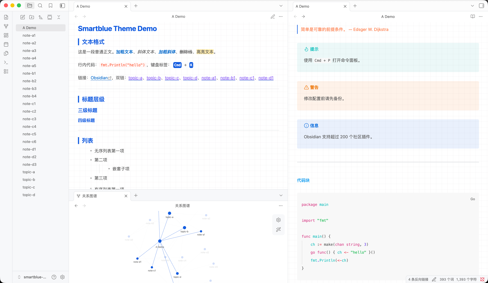
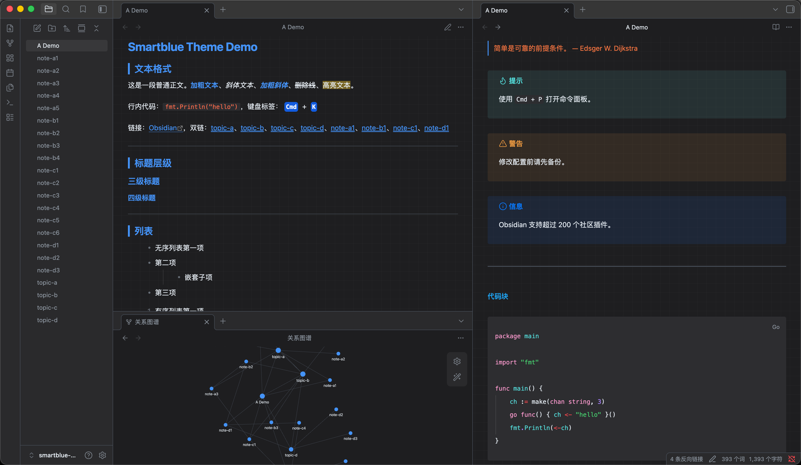

# Gridnote

一款清爽的 Obsidian 主题，网格背景 + 蓝色标题 + 多彩编辑器标记。配色灵感来自[稀土掘金](https://juejin.cn/)编辑器的 smartblue 主题。

[English](README.md)

## 特性

- 📐 背景网格纹理，增加层次感
- 🔵 蓝色标题，H2 带左边框强调
- ✍️ 编辑器标记彩色高亮（标题、引用、链接、代码、加粗）
- 🔴 行内代码红色文字 + 浅粉背景
- 📊 GitHub 风格表格（斑马纹 + 清晰边框）
- 💬 引用块浅粉背景 + 紫灰左边框
- 🌗 完整的深色 / 浅色模式支持
- 📈 图谱视图样式定制

## 安装

### 从 Obsidian 社区主题市场安装

1. 打开 **设置 → 外观 → 主题 → 管理**
2. 搜索 **Gridnote**
3. 点击 **安装并使用**

### 手动安装

1. 从 [最新 Release](https://github.com/itallenZ/obsidian-theme-gridnote/releases/latest) 下载 `theme.css` 和 `manifest.json`
2. 在 vault 中创建目录：`.obsidian/themes/Gridnote/`
3. 将两个文件放入该目录
4. 设置 → 外观 → 主题 → 选择 **Gridnote**

## 配色方案

| 角色 | 浅色模式 | 深色模式 |
|------|----------|----------|
| 标题 | `#135ce0` | `#4493f8` |
| 加粗 / 链接 | `#036aca` | `#4493f8` |
| 正文 | `#595959` | `#e6edf3` |
| 行内代码 | `#ff502c` | `#ff6b4a` |
| 引用文字 | `#666` | `#c8c8d0` |
| 引用背景 | `#fff9f9` | `#2e2e35` |
| 表格边框 | `#dfe2e5` | `#444c56` |

### 编辑器标记色彩

| 标记 | 颜色 |
|------|------|
| `#` 标题 | `#1ba2f0` |
| `>` 引用 | `#fd7741` |
| `**` 加粗标记 | `rgb(236,127,79)` |
| 加粗文字 | `#036aca` |
| `` 链接 | `#bb51b8` |
| `` ` `` 代码 | `#009e9d` |
| `==` 高亮 | `#fd7741` |
| `#tag` | `#009e9d` |

## 致谢

配色灵感来自[稀土掘金](https://juejin.cn/)编辑器的 [smartblue 主题](https://github.com/xitu/juejin-markdown-themes)。

## 许可证

[MIT](LICENSE)
